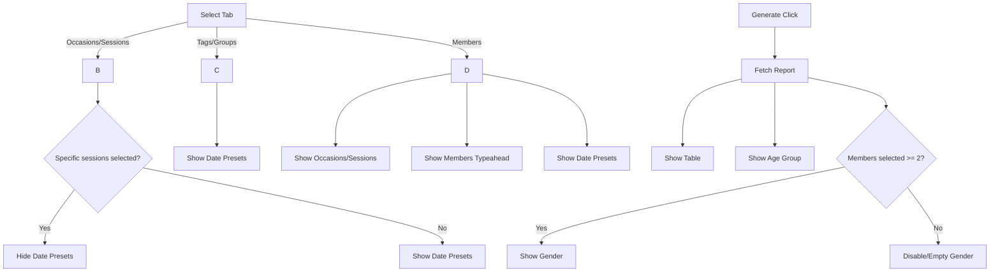

# Attendance Reports — Wireframe (Editable Markdown)

This wireframe outlines the layout and visibility logic for filters and report widgets. Edit this file to iterate quickly on the structure.

## Top-Level Structure

```
[ Title: Attendance Reports & Insights ]

[ Filters Tabs ]  Occasions & Sessions | Tags & Groups | Members

[ Active Filter Widget (depends on tab) ]
  ├─ Occasions & Sessions
  │   ├─ Occasions: [ Select ]  (Default: All Occasions)
  │   ├─ Sessions:   [ MultipleSelector ]  (Default: All Sessions)
  │   └─ Date Presets/Range: [ DatePresetPicker ]  (Hidden when specific sessions selected)
  │
  ├─ Tags & Groups
  │   ├─ Tags:   [ MultipleSelector ] (Relational Tag Items)
  │   ├─ Groups: [ MultipleSelector ] (Group list)
  │   └─ Date Presets/Range: [ DatePresetPicker ] (Always visible)
  │
  └─ Members
      ├─ Occasions & Sessions: (same widget as above, optional scope)
      ├─ Members: [ MemberSearchTypeahead ] (multi-select)
      └─ Date Presets/Range: [ DatePresetPicker ] (Always visible)

[ Actions ]  (Right-aligned on desktop)
  └─ [ Generate Report ]  (Enabled: see rules below)

[ Reports Area ]  (Visible only after Generate)
  ├─ Table Widget  [ Export ▼ ]
  ├─ Age Group Widget  [ Export ▼ ] (uses useAgeGroupManagement)
  └─ Gender Widget  [ Export ▼ ] (disabled if only one member selected in Members mode)
```

## Visibility Rules (Summary)

- Show Occasions & Sessions widget when tab = Occasions & Sessions OR tab = Members.
- Show Tags & Groups widget only when tab = Tags & Groups.
- Show Members widget only when tab = Members.
- Show Date Presets/Range:
  - Occasions & Sessions: hide if specific session(s) selected; otherwise show.
  - Tags & Groups: always show.
  - Members: always show.
- Show Report Widgets only after user clicks Generate and data loads.
- Gender Widget disabled/empty when tab = Members and selected member count < 2.

## Desktop Layout (Grid)

```
.grid
├─ Row 1: Header (Title + optional summary indicators)
├─ Row 2: Tabs (full width)
├─ Row 3: Active Filter Widget (2–3 columns where space allows)
│   ├─ Col A: Primary input(s)
│   ├─ Col B: Secondary input(s)
│   └─ Col C: Date Preset/Range (conditional)
├─ Row 4: Actions (Generate button; align end)
└─ Row 5+: Report Widgets (two-column on large screens; stacked on mobile)
```

## Mobile Layout (Stack)

```
[ Title ]
[ Tabs ]
[ Filter Widget ]
  - Occasions
  - Sessions
  - Date Presets/Range (conditional)
[ Generate ] (full width)
[ Table Widget ]
[ Age Group Widget ]
[ Gender Widget ]
```

## Component Placement Notes

- Each widget includes a right-aligned `ReportExportMenu` dropdown.
- Use consistent Card styling for all widgets with `CardHeader` → `CardTitle` → `CardContent`.
- Keep empty/disabled states explicit with supportive text.

## Mermaid: Filter & Visibility Logic



## Export Menu (Dropdown)

- CSV, XLSX, PDF, Print, Email.
- Provide `filenameBase`, `getRows`, optional `getSummary`.
- Disable when widget lacks data.

## Notes for Implementation

- Use `useReportFilters` for state and computed flags.
- Centralize query building in `buildReportQuery` for correctness.
- Debounce typeahead; paginate or virtualize long tables.